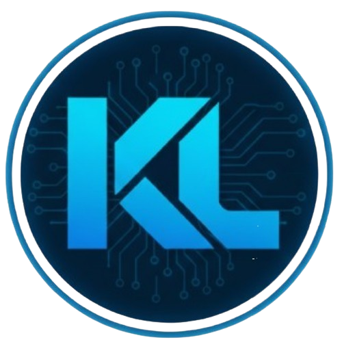

  

   

  
  
  

  
  

  
  **Cientista da Computação (8º semestre - CEUB) | Backend Developer**
  
  Desenvolvedor na **ECODOTS**, focado no desenvolvimento de APIs REST com FastAPI e Flask, integração com bancos relacionais e organização de código em camadas. Sou movido por transformar lógica em produtos que geram valor real para o usuário final.
  
  ### 🏆 Destaque: KitPC
  O **KitPC** é meu projeto em fase inicial, já validando aquisição de usuários via SEO com crescimento orgânico contínuo. Recentemente alcançou a marca de **50 cliques orgânicos mensais** via Google Search, validando na prática minhas estratégias de:
  - Desenvolvimento Backend (FastAPI/Flask)
  - Desenvolvimento Frontend (HTML/CSS)
  - Modelagem de Dados e Performance
  - SEO Estratégico e Aquisição de Usuários
  
  👉 [Acesse o KitPC](https://kitpc.com.br)

 

## 🧠 Backend & Engineering Skills

  <table border="0">
    <tr>
      <td><b>🌐 Web Development</b></td>
      <td><b>💾 Data & Infrastructure</b></td>
    </tr>
    <tr>
      <td>• APIs REST (FastAPI & Flask) • Arquitetura Limpa (Clean Code) • Integração de APIs e Services</td>
      <td>• Modelagem MySQL & PostgreSQL • CRUDs e Migrations • Linux & Git Workflow</td>
    </tr>
  </table>

 

## 🎯 Objetivo

Busco oportunidade como Desenvolvedor Backend Júnior para atuar no desenvolvimento de APIs, trabalhar com dados e evoluir em ambientes reais de produção.

<h3>🛠️ Tech Stack</h3>

 

<h3>📊 Github Activity</h3>

---

 

_"Code is like humor. When you have to explain it, it’s bad."_

